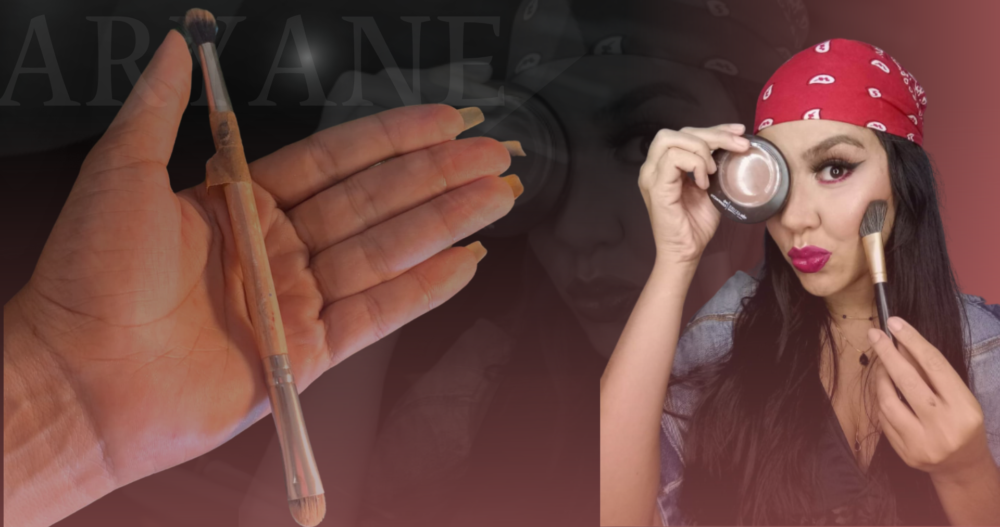

<h1 align="center">

*🌟Projeto Aryane Cardoso🌟*
 </h1>
 

### 📕Sobre

 Este projeto foi desenvolvido com o intuito de captar cliente para um curso de maquiagem desenvolvido pela  profissional Aryane Cardoso.

Com um Curso de maquiagem totalmente Desenvolvido, Aryane precisava de uma ferramenta solida para divulgar o seu trabalho, captar clientes e gerênciar o cadastro dos inscritos

 Foi então que surgiu a idéia de uma landing page criada para que as pessoas interessadas em maquigem, pudessem conhecer o trabalho da aryane, o curso desenvolvido, alem das tecnicas que serão ensinadas no curso, com o intuito de alcançar o objetivo principal que é a geração de leads e a venda do curso do auto maquiagem.

## Layout

    
    

## 🔨Ferramentas Utilizadas
 
 ### Back end
 - PHP
 - Mysql

 ### Front end
 - HTML5
 - CSS3
 - JavaScript
 - JQuery